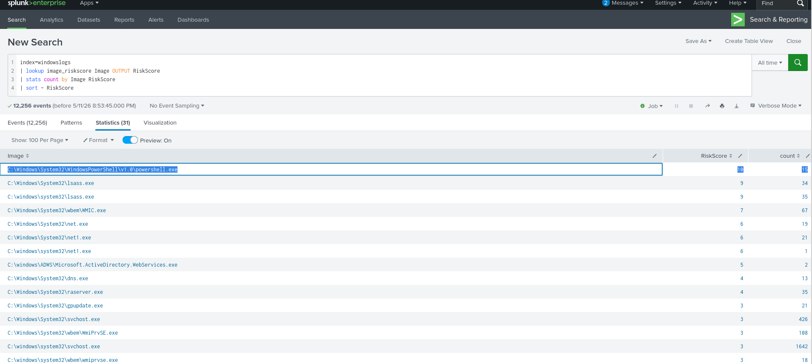
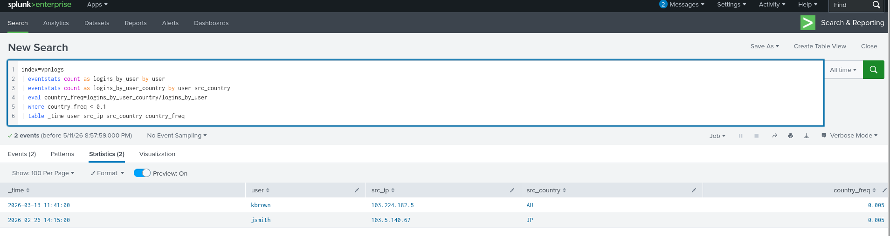
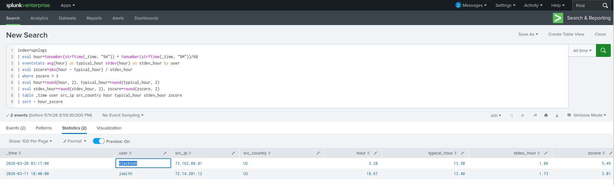

# Splunk SPL Cheat Sheet (Practical SOC / Threat Hunting Edition) 👨‍💻👩‍💻

---

# 1. Basic Search

Search entire index:

```spl
index=windowslogs
```

Meaning:

Search all events inside the `windowslogs` dataset.

---

Search keyword:

```spl
index=windowslogs powershell
```

Meaning:

Find events containing:

```text
powershell
```

---

Exact phrase:

```spl
index=windowslogs "failed login"
```

Meaning:

Find exact phrase.

Order matters.

---

Multiple keywords:

```spl
index=windowslogs malware ransomware
```

Meaning:

Both words must exist.

---

# 2. Field Filtering

Exact match:

```spl
User=Aditya
```

Not equal:

```spl
User!=SYSTEM
```

Greater than:

```spl
Bytes>1000
```

Less than:

```spl
Age<10
```

Greater or equal:

```spl
Count>=50
```

Less or equal:

```spl
Count<=20
```

---

# 3. Logical Operators

AND:

```spl
User=James AND EventID=4624
```

Both conditions true.

---

OR:

```spl
User=James OR User=Alice
```

Either condition true.

---

NOT:

```spl
NOT User=SYSTEM
```

Exclude SYSTEM.

---

IN:

```spl
User IN (James, Alice, Bob)
```

Cleaner OR alternative.

---

# 4. Wildcards

Starts with:

```spl
User=adm*
```

Matches:

```text
admin
administrator
adm_root
```

---

Contains:

```spl
CommandLine=*powershell*
```

Matches:

```text
run powershell
powershell.exe
abc powershell xyz
```

---

IP partial:

```spl
SourceIp=172.*
```

---

Subnet:

```spl
SourceIp=172.18.0.0/16
```

---

# 5. Useful Windows Event IDs

Successful login:

```spl
EventID=4624
```

Failed login:

```spl
EventID=4625
```

Process creation (Sysmon):

```spl
EventID=1
```

Network connection:

```spl
EventID=3
```

Registry modification:

```spl
EventID=13
```

Service creation:

```spl
EventID=7045
```

PowerShell Script Block Logging:

```spl
EventID=4104
```

---

# 6. Time Filtering

Last 24 hours:

```spl
earliest=-24h
```

Last 7 days:

```spl
earliest=-7d
```

Specific range:

```spl
earliest="04/15/2022:08:05:00" latest="04/15/2022:08:06:00"
```

Example:

```spl
index=windowslogs earliest=-1h
```

---

# 7. fields Command

Show only chosen fields:

```spl
| fields User SourceIp EventID
```

Before:

| User | SourceIp | EventID | Host | CommandLine |
| ---- | -------- | ------- | ---- | ----------- |

After:

| User | SourceIp | EventID |

---

Exclude field:

```spl
| fields - CommandLine
```

---

# 8. table Command

Readable output:

```spl
| table _time User SourceIp EventID
```

Example:

| Time | User | IP | Event |
| ---- | ---- | -- | ----- |

SOC reporting favorite.

---

# 9. stats Command

## What does stats do?

It summarizes data.

But destroys original raw rows.

Example raw data:

| Time  | User   | Country |
| ----- | ------ | ------- |
| 10:00 | kbrown | US      |
| 10:05 | kbrown | US      |
| 10:10 | jsmith | JP      |

Query:

```spl
| stats count by User
```

Breakdown:

* count events
* group by user

Result:

| User   | count |
| ------ | ----- |
| kbrown | 2     |
| jsmith | 1     |

Notice:

Original rows vanished.

No timestamps.
No countries.

Only summary remains.

---

Count by field:

```spl
| stats count by SourceIp
```

Average:

```spl
| stats avg(Bytes)
```

Max:

```spl
| stats max(Bytes)
```

Min:

```spl
| stats min(Bytes)
```

Sum:

```spl
| stats sum(Bytes)
```

Multiple:

```spl
| stats count avg(Bytes) max(Bytes) by User
```

---

# 10. eventstats Command

## What does eventstats do?

Same calculations as stats.

BUT keeps original events.

Raw data:

| Time  | User   | Country |
| ----- | ------ | ------- |
| 10:00 | kbrown | US      |
| 10:05 | kbrown | US      |
| 10:10 | jsmith | JP      |

Query:

```spl
| eventstats count by User
```

Result:

| Time  | User   | Country | count |
| ----- | ------ | ------- | ----- |
| 10:00 | kbrown | US      | 2     |
| 10:05 | kbrown | US      | 2     |
| 10:10 | jsmith | JP      | 1     |

Difference:

`stats`

→ replace rows

`eventstats`

→ enrich rows

---

Another example:

Raw:

| User   | Country |
| ------ | ------- |
| kbrown | US      |
| kbrown | US      |
| kbrown | JP      |

Query:

```spl
| eventstats count by user src_country
```

Result:

| User   | Country | count |
| ------ | ------- | ----- |
| kbrown | US      | 2     |
| kbrown | US      | 2     |
| kbrown | JP      | 1     |

This is why anomaly detection uses eventstats.

Because raw rows must survive.

---

Memory trick:

```text
stats = summarize & replace
eventstats = summarize & keep
```

---

# 11. top / rare

Most frequent:

```spl
| top User
```

Example:

| User   | count |
| ------ | ----- |
| SYSTEM | 500   |

---

Top 5:

```spl
| top User limit=5
```

---

Least frequent:

```spl
| rare User
```

Good for anomaly hunting.

---

# 12. sort

Ascending:

```spl
| sort User
```

Descending:

```spl
| sort - count
```

Highest first.

---

# 13. reverse

Flip order:

```spl
| reverse
```

Good for timelines.

---

# 14. head / tail

Newest first 10:

```spl
| head 10
```

Oldest last 10:

```spl
| tail 10
```

---

# 15. dedup

Remove duplicates:

```spl
| dedup SourceIp
```

Before:

```text
1.1.1.1
1.1.1.1
2.2.2.2
```

After:

```text
1.1.1.1
2.2.2.2
```

---

# 16. rename

Rename fields:

```spl
| rename User as Employee
```

Before:

| User |

After:

| Employee |

---

# 17. regex

Ends with exe:

```spl
| regex Image="\.exe$"
```

Contains powershell:

```spl
| regex CommandLine=".*powershell.*"
```

Starts with admin:

```spl
| regex User="^admin"
```

---

# 18. eval

Create field:

```spl
| eval status="Suspicious"
```

Math:

```spl
| eval total=sent+received
```

If logic:

```spl
| eval verdict=if(Bytes>1000,"High","Normal")
```

Case:

```spl
| eval type=case(
EventID=4624,"Success",
EventID=4625,"Failure"
)
```

---

# 19. where

Filter after calculations:

```spl
| where count > 10
```

Example:

```spl
| stats count by User
| where count > 5
```

---

# 20. chart

Visualization summary:

```spl
| chart count by User
```

---

# 21. timechart

Trend over time:

```spl
| timechart count
```

30 min bins:

```spl
| timechart span=30m count
```

Top processes:

```spl
| timechart span=30m count by Image
```

---

# 22. iplocation

Geo enrichment:

```spl
| iplocation SourceIp
```

Example:

| IP | Country | Region |
| -- | ------- | ------ |

Then:

```spl
| stats count by Country
```

---

# 23. lookup

External enrichment:

```spl
| lookup image_riskscore Image OUTPUT RiskScore
```

Uses:

* threat intel
* IOC CSVs
* asset criticality
* employee role mappings

---

# 24. join

Correlation:

```spl
| join LogonId
```

Example:

Process + authentication correlation.

Heavy query.

---

# 25. subsearch

Nested search:

```spl
[ search index=windowslogs EventID=4624 ]
```

Example:

```spl
index=windowslogs EventID=1
| join LogonId
    [ search index=windowslogs EventID=4624 ]
```

---

# 26. highlight

Visual marking:

```spl
| highlight powershell malware cmd.exe
```

Useful in raw view.

---

# 27. Anomaly Detection Patterns

Rare country:

```spl
| eventstats count by user
| eventstats count by user src_country
| eval freq=country_count/user_count
| where freq < 0.1
```

Weird login hour:

```spl
| eventstats avg(hour) stdev(hour) by user
| eval zscore=abs(hour-avg)/stdev
| where zscore > 3
```

---

# 28. Threat Hunting Queries

PowerShell:

```spl
index=windowslogs powershell
```

Encoded PS:

```spl
CommandLine=*EncodedCommand*
```

LOLBins:

```spl
Image IN ("cmd.exe","powershell.exe","mshta.exe","certutil.exe")
```

Failed auth:

```spl
EventID=4625
```

Admin success login:

```spl
EventID=4624 User=Administrator
```

Suspicious parent:

```spl
EventID=1 ParentImage=*powershell*
```

---

# 29. Practical Pipeline Logic

Think:

```text
SEARCH → FILTER → SUMMARIZE → CALCULATE → FORMAT
```

Example:

```spl
index=windowslogs EventID=4624
| stats count by User
| where count > 10
| sort - count
| table User count
```

Meaning:

* find successful logins
* count per user
* keep noisy users
* sort descending
* clean report

---

# Bonus: Mini SOC Case Study — Hunting Insider Threat + Rare Logins + Suspicious Processes 🕵️‍♂️

In real SOC environments, commands don’t exist in isolation.

You chain them.

Here’s a small practical investigation using multiple SPL concepts together. Based on the same detections we discussed. 

---

## Scenario

A SOC analyst receives an alert:

> “Unusual login behavior detected for multiple users.”

Goal:

Determine whether this is:

* compromised credentials
* insider misuse
* suspicious remote access
* malicious process execution

---

## Step 1 — Detect Unusual Login Hours

Query:

```spl
index=vpnlogs
| eval hour=tonumber(strftime(_time,"%H")) + tonumber(strftime(_time,"%M"))/60
| eventstats avg(hour) as typical_hour stdev(hour) as stdev_hour by user
| eval zscore=abs(hour-typical_hour)/stdev_hour
| where zscore > 3
| eval hour=round(hour,2), typical_hour=round(typical_hour,2)
| eval stdev_hour=round(stdev_hour,2), zscore=round(zscore,2)
| table _time user src_ip src_country hour typical_hour stdev_hour zscore
| sort - zscore
```

Screenshot:



(Use your first uploaded screenshot path accordingly)

### Investigation

This query calculates:

* user’s normal login time
* deviation from baseline
* anomaly score (z-score)

Findings:

* `njackson` logged in at **3.28 AM**
* usual behavior: **13.50 (1:30 PM)**
* z-score: **5.49**

Meaning:

This is statistically abnormal.

That’s not “just late working.”

That’s a major deviation.

Similarly:

* `jsmith`
* z-score: **3.01**

Also suspicious.

---

## Step 2 — Rare Country Login Detection

Next question:

> Is the user logging in from a strange geography?

Query:

```spl
index=vpnlogs
| eventstats count as logins_by_user by user
| eventstats count as logins_by_user_country by user src_country
| eval country_freq=logins_by_user_country/logins_by_user
| where country_freq < 0.1
| table _time user src_ip src_country country_freq
```

Screenshot:



### Investigation

Logic:

If:

* user usually logs in from US
* suddenly appears from AU or JP
* and that country represents less than 10% of history

Flag it.

Findings:

* `kbrown` from **AU**
* frequency: **0.005**

Meaning:

0.5% of historical behavior.

That’s highly anomalous.

Another:

* `jsmith` from **JP**
* also **0.005**

Potential indicators:

* VPN abuse
* credential theft
* remote attacker access
* impossible travel scenario

---

## Step 3 — Suspicious Process Execution Risk Hunt

Now pivot into endpoint telemetry.

Query:

```spl
index=windowslogs
| lookup image_riskscore Image OUTPUT RiskScore
| stats count by Image RiskScore
| sort - RiskScore
```

Screenshot:



### Investigation

This enriches process execution data using a lookup table.

Meaning:

Known binaries are assigned threat weights.

Example findings:

| Process        | Risk |
| -------------- | ---- |
| powershell.exe | 10   |
| lsass.exe      | 9    |
| WMIC.exe       | 7    |
| net.exe        | 6    |

Interpretation:

#### PowerShell

Risk score 10 because attackers love it for:

* fileless malware
* encoded payloads
* download cradles
* privilege escalation

Example:

```powershell
powershell -enc <base64>
```

---

#### LSASS

Critical because credential dumping targets it.

Tools:

* Mimikatz
* ProcDump abuse

---

#### WMIC

Classic LOLBin.

Used for:

* remote execution
* recon
* persistence

---

#### net.exe

Common for:

```cmd
net user
net localgroup administrators
```

Privilege enumeration.

---

## Final Correlation

Now combine findings:

Observed:

✅ abnormal login hour <br/>
✅ rare login geography <br/>
✅ suspicious process execution <br/>

This dramatically increases confidence.

Instead of isolated weak signals:

you now have a correlated intrusion story.

Possible hypothesis:

> Attacker stole credentials, logged in remotely at unusual hours, then executed native Windows tooling for recon/post-exploitation.

---

## Analyst Takeaway

Good SOC hunting isn’t:

“Run one query.”

It’s:

```text
Detect → Enrich → Correlate → Investigate
```

That’s the real analyst workflow.

---

# Mental Model

```text
search = find
fields = select
table = display
stats = summarize & replace
eventstats = summarize & keep
eval = calculate
where = filter after calc
top = common
rare = uncommon
lookup = enrich
iplocation = geo enrich
regex = pattern match
timechart = trends
```

---
